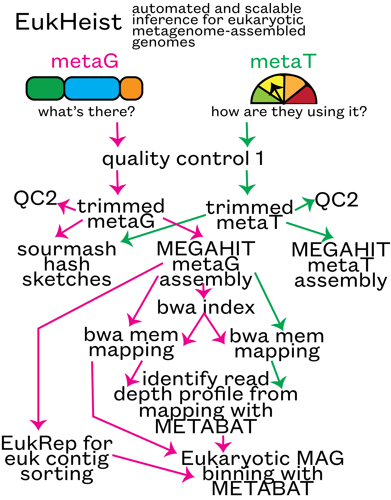

# EukHeist: Capturing environmental eukaryotic genomes
## Snakemake-based workflow for the retrieval of Eukaryotic (and other) genomes from metagenomes


## 1.0 Introduction
Molecular and genomic approaches, particularly those applied to whole, mixed communities (e.g. metagenomics, metatranscriptomics), have shed light on the ecological roles, evolutionary histories, and physiological capabilities of these organisms. We developed a scalable and reproducible pipeline to facilitate the retrieval, taxonomic assignment, and annotation of eukaryotic metagenome assembled genomes (MAGs) from mixed community metagenomes. The below representation of the pipeline shows how **EukHeist** can be used to retrieve eukaryotic (and other) metagenome assembled genomes from the *Tara Oceans* global dataset.

_General workflow_




_User workflow_
* get set up on HPC with `Snakemake`
* input sample list, assembly group
* run tests and confirm rules in pipeline you plan to use


## 2.0 Set up

Locate and organize metagenomic and metatranscriptomic fastq files. Create a raw reads directory, and within that a single directory for your metagenomic reads and a second directory for metatranscriptomic reads. You will need to know the full path for all files, individual sample IDs, and an idea of how the assemblies should be grouped. This grouping may be selected on the basis of anticipated sample similarity: e.g., you may wish to co-assemble several replicates from a single or closely-related set of sampling locations in order to maximize metagenome-assembled genome recovery but minimize mixing of organisms from distinct sites. In this step, we are creating input file lists that will tell `EukHeist` where to look for our input fastq reads, what to name them, and how to group the assemblies and mapping steps.


### 2.1 Structure input fastq files in individual directories

Example file structure:
```
 EukHeist/raw_dir/
 ├── metagenome
 └── metatranscriptome
```

To use the test data, run:
```bash download-test-data.sh```

This will download raw reads, for a test run, to the metagenome and metatranscriptome directories. This is also a way by which you can familiarize yourself with the format that we expect and get ready for your future runs of `EukHeist`. 

### 2.2 Create _sample list_ files for metagenome and metatranscriptome data

The final sample list files should look like this, with complete paths under "FULLPATH" and the assembly grouping lists how you want the samples to be assembled for the metagenomic and metatranscriptomic pipelines. In this example, all three of these files would be assembled together in a single `MEGAHIT` assembly, because they have the same "ASSEMBLY_GROUPING" name. If you don't want any of your samples to be assembled in the same batch, you can simply name the assembly group the same way you named the sample.

**Example sample list files**

```
SAMPLEID        SAMPLENAME      OMIC    FULLPATH        R1      R2      ASSEMBLY_GROUPING
ERR1163068      CTD1200_DNA     METAGENOMIC     /../../../metagenome ERR1163068_1.fastq.gz   ERR1163068_2.fastq.gz   CTD1200_DNA
ERR1163069      CTD1200_DNA     METAGENOMIC     /../../../metagenome ERR1163069_1.fastq.gz   ERR1163069_2.fastq.gz   CTD1200_DNA
ERR1163070      CTD1200_DNA     METAGENOMIC     /../../../metagenome ERR1163070_1.fastq.gz   ERR1163070_2.fastq.gz   CTD1200_DNA
```

See example file "input-samplelist-example-metagenomic.txt". These should be _.txt_ files and separated with a tab.


### 2.3 Generate an *Assembly group* file

The first column, 'ASSEMBLY_GROUPING' lists the unique names for each group specified from the sample list file. The second column lists the sample IDs (in this example, the accession numbers), that are associated with the ASSEMBLY_GROUPING. These sample IDs are collapsed with commas. This file should match your list of samples above (so if you have one sample per assembly group, every sample list in this file should have only one sample and should not be separated by commas.

```
ASSEMBLY_GROUPING       SAMPLE_LIST
Group1  ERR1726828,ERR599214
Group2  ERR868421
```


Create sample list files that end in `metatranscriptomic.txt` and `metagenomic.txt`, and run this R script to automatically generate the Assembly group files. 

Run Rscript ```/../generate-assembly-group-tables.r```; this will input the sample list file and generate the assembly grouping file, as long as the sample names designate the assembly groups.


## 3.0 Set up EukHeist

Start by cloning this repo.
```
git clone https://github.com/AlexanderLabWHOI/EukHeist.git
```

Then, create a conda environment to run the EukHeist pipeline. We recommend using [mamba](https://mamba.readthedocs.io/en/latest/installation.html) for this, use ```conda install mamba -n base -c conda-forge``` to install mamba to your base conda environment. 

```
conda create -n EUKHeist -c conda-forge mamba #create EUKHeist environment
conda activate EUKHeist #activate EUKHeist
mamba install -c bioconda -c conda-forge snakemake python jinja2 networkx matplotlib graphviz #install items from bioconda and conda-forge needed to run pipeline
```
_Update above instructions later when versions of needed software is updated_


### 3.1

Modify ```hierarchy_cluster.yaml``` to tell EukHeist the location of raw read directories, assembly group table, and where you want results to be stored.

Explanation of ```hierarchy_cluster.yaml``` file:

```
directories:
    input: test-data # Input path for where metagenomic and metatranscriptomic reads are
    output: /vortexfs1/omics/alexander/akrinos/EUKHeist_test # Set a location as your output directory
    scratch:  /vortexfs1/scratch/akrinos/EUKHeist_scratch # Full path for scratch directory

metaG:
    create_sample_table: False
    sample_data_table: test-data/samplelist-metaG-wgroups.txt  # Location of metagenomic sample list
    assembly_group_table: test-data/assembly-list-metaG.txt  # Location of metagenomic assembly list
    folder_name: metaG # Directory name (within "input") where metagenomic reads are located
    
metaT:
    create_sample_table: False
    sample_data_table: test-data/samplelist-metaT-wgroups.txt
    assembly_group_table: test-data/assembly-list-metaT.txt 
    folder_name: metaT #PRJEB6609

adapters: input/adapters/illumina-adapters.fa
mode: metaG

megahit:
    cpu: 80
    min_contig: 1000
    mem: .95
    other: --continue --k-list 29,39,59,79,99,119

```

Co-assembly will be dictated by user providing a column in the sample list input file and toggling the ```create_sample_table:``` to True or False.
In each...?


### 3.2 Review working directory

_Need to clean this up when we have a final working version_

Explanation of working directory:

```
EukHeist
├── cluster.yaml # File that is modified by user to run snakemake on HPC
├── config.yaml #RM
├── environment.yaml # Environment to create snakemake conda env
├── envs # Directory with all environment files for each snakemake rule
├── EUKHeist # Snakemake script for EukHeist
├── hierarchy_cluster.yaml # User-modified file that configures EukHeist to run your samples
├── input # Necessary input files to run EukHeist
├── LICENSE
├── README.md
├── rules # each step of the snakemake pipeline is a 'rule'
├── scripts # Directory with additional scripts used in EukHeist
├── Snakefile #RM
├── start-up #RM?
└── submit_script #RM?

```

## 4.0 Execute EukHeist dry run / test

EukHeist relies on the workflow manager called 'Snakemake'. Snakemake will create a script of all required commands and make sure needed files are correct and that all rules can be executed. We can use the "dry run" approach to perform an initial test of our EukHeist run.


### 4.1 Set up with your HPC

Navigate to the EukHeist directory and modify the ```cluster.yaml``` file to for specific HPC access. Under ```__default__``` you can specify your account information, threads, time, and node that will be used for each slurm run. Then below, each rule has a set of thread, memory, and time parameters that can be modified for your individual dataset. For instance, the **trimmomatic*** step looks like this:
```
trimmomatic:
    queue: compute
    threads: 6
    mem: 24
    time: 720
```

### 4.3 Run Snakemake test run

If running with your HPC and slurm, navigate to ```EukHeist/submit_script/```. There are three bash scripts that can be used to run dry tests of your EukHeist workflow and to actually submit the whole thing to slurm.

In order to execute a dry run, enable the EukHeist conda environment you previously created, then use the ```-s``` and ```-np``` flags with snakemake to test the workflow.

```
conda activate EukHeist # Prefix to each line should now read "(EukHeist)"

snakemake -s EUKHeist -np --use-conda
```

### 4.4 Execute full snakemake pipeline 

Once you get a green output from snakemake with the dry run, it means that the EukHeist pipeline is ready to run. Run the bash script in the ```submit_script``` directory to send all jobs to slurm. This will enable the parameters you specified in the cluster.yaml file.

```
bash submit_script/submit_snakemake.sh

## If not using HPC
# snakemake -s EUKHeist --use-conda --cores <number of available cores>
```


## 5.0 EukHeist output

Within the ```output-data``` directory, final file structure should look like this.

```
.
├── eukrep       # sorted prok vs euk contigs
├── logs
├── megahit       # co-assembled contigs
├── metabat2      # bwa-derived abundances of prok contigs
├── metabat2_euk  # bwa-derived abundances of euk contigs
├── prodigal
└── qc

# From scratch
.
├── bwa_index
├── mapping
├── sourmash
└── trimmed
```


### 6.0 snakemake troubleshooting

* When throwing an error, snakemake will list log files. Each time snakemake is executed, a log file is created in ```CURRENT_SNAKEMAKE_DIR/.snakemake/log/```. These are dated and provide the printed output. Some common errors and steps to diagnose.   

* *Compatibility with snakemake and conda* Note the version of snakemake and anaconda you are using. Upon conda's switch from _source activate_ to _conda activate_, snakemake was not calling on the conda environments properly. Errors associted with these were ```returned non-zero exit status 127``` and an error about *line 56* in *thread.py* like this: ```LOCATION_OF_YOUR_CONDA_ENVS/.conda/envs/snake-18S/lib/python3.6/concurrent/futures/thread.py", line 56, in run```
Update your version of snakemake. Versions listed above are compatible. This error will also be generated when there is an incomptaible conda environment called, such as an outdated [snakemake wrapper](https://snakemake-wrappers.readthedocs.io/en/stable/). Try updating that - but ensure you have first updated the snakemake version.   

* Check all log files, found in ```./snakemake/log``` and the log files generated as output. Most helpful are the output files from each slurm job, ```slurm-XXX.out```. Look at the most recent slurm out files after a job fails to find more informative errors.    

* _Error in rule_ xxx: Typically, snakemake will also tell you which rule an error occurred. In this example, an error read ```Error in rule fastqc:``` and pointed to the location of the fastqc log file itself (for EukHeist this will be in output data). We we inspected the fastqc log file, it was discovered that the .yaml file for fastqc had an issue, so snakemake was not able to create this environment or find 'fastqc' to run.

* _KeyError_ : In the case of a Key Error, this indicates that some samples are not named correctly. This should become apparent during the test runs of snakemake where EukHeist will go through all the code it plans to run and makes sure that all files will exist and are named correctly. In the case of EukHeist, ensure your assembly group name and sample list files are free of typos. Typically the key error will provide an example of where snakemake found the error, so this can be used to search for a potential typo.

* See ```snakemake -h``` for additional commands to clean up working snakemake environment, list steps, or restarting attempts, etc. When running, snakemake "locks" the working directory, so only one snakemake command can be run at a time. If you have to cancel, make sure to run ```snakemake --unlock``` to clear it. See other flags to clean up your working environment after updated conda, snakemake, or other environment versions (```--cleanup-shadow```, ```--cleanup-conda```).
To look for additional code error that may result in Syntax errors, try adding this to snakemake execution:
* ```--summary``` or ```--detailed-summary```
* ```--printshellcmds```
* ```--debug```

* During the trimmomatic step, if you run into an error that looks like this:
```
Exception in thread "main" java.io.EOFException: Unexpected end of ZLIB input stream
        at java.base/java.util.zip.InflaterInputStream.fill(InflaterInputStream.java:245)
        at java.base/java.util.zip.InflaterInputStream.read(InflaterInputStream.java:159)
        at java.base/java.util.zip.GZIPInputStream.read(GZIPInputStream.java:118)
        at org.usadellab.trimmomatic.util.ConcatGZIPInputStream.read(ConcatGZIPInputStream.java:73)

```
It indicates that there is something wrong with your original fastq file and trimmomatic detected it. To test your raw fastq files, use the command ```gunzip -t <fastq-file-name> && echo "VALID"```, the output will print "VALID" if the fastq file is formatted and zipped properly. It there is an issue, you may need to re-download the raw sequence file.


## TO DO
* update so that input files can be R1_001.fastq.gz or 1.fastq.gz - or else?
* Add example sample list and assembly list
* (a) ensures all fastq files in SAMPLE LIST are present and not duplicated file names, (b) all samples listed in the ASSMEBLY GROUPS are also present in the SAMPLE LIST and not included more than once.
* additional details on how the snakemake EUKHeist pipeline is set up (rules directory, etc).
* Documentation specific for Tara ocean?
* Check sarah's modified environments and fastqc rule for some revisions to EUKHeist pipeline.
