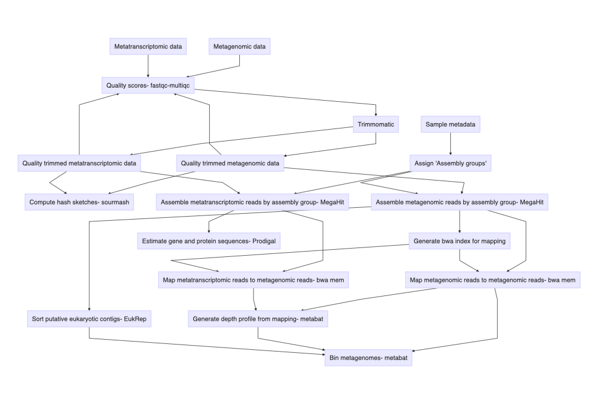

# EukHeist: Capturing environmental eukaryotic genomes
## Snakemake-based workflow for the retrieval of Eukaryotic (and other) genomes from metagenomes


## 1.0 Introduction
Molecular and genomic approaches, particularly those applied to whole, mixed communities (e.g. metagenomics, metatranscriptomics), have shed light on the ecological roles, evolutionary histories, and physiological capabilities of these organisms. We developed a scalable and reproducible pipeline to facilitate the retrieval, taxonomic assignment, and annotation of eukaryotic metagenome assembled genomes (MAGs) from mixed community metagenomes. The below pipeline uses **EukHeist** to retrieve eukaryotic (and other) metagenome assembled genomes from the *Tara Oceans* global dataset.

_General workflow_




_User workflow_
* get set up on HPC with snakemake
* input sample list, assembly group
* Run tests and confirm rules in pipeline you plan to use


## 2.0 Set up

Locate and organize metagenomic and metatranscriptomic fastq files. Create a single directory for your metagenomic reads and a second directory for metatranscriptomic reads. You will need to know the full path for all files, individual sample IDs, and an idea of how the assemblies should be grouped. In this step, we are creating input file lists that will tell EukHeist where to look for our input fastq reads, what to name them, and how to group the assemblies or mapping.


### 2.1 Structure input fastq files in individual directories

Example file structure:
```
 EukHeist/raw_dir/
 ├── metagenome
 └── metatranscriptome
```

To use the test data, run:
```bash download-test-data.sh```

This will download raw reads, for a test run, to the metagenome and metatranscriptome directories.

### 2.2 Create _sample list_ files for metagenome and metatranscriptome data

The final sample list files should look like this, with complete paths under "FULLPATH" and the assembly grouping lists how you want the samples to be assembled for the metagenomic and metatranscriptomic pipelines.

**Example sample list files**

```
SAMPLEID        SAMPLENAME      OMIC    FULLPATH        R1      R2      ASSEMBLY_GROUPING
ERR1163068      CTD1200_DNA     METAGENOMIC     /../../../metagenome ERR1163068_1.fastq.gz   ERR1163068_2.fastq.gz   CTD1200_DNA
ERR1163069      CTD1200_DNA     METAGENOMIC     /../../../metagenome ERR1163069_1.fastq.gz   ERR1163069_2.fastq.gz   CTD1200_DNA
ERR1163070      CTD1200_DNA     METAGENOMIC     /../../../metagenome ERR1163070_1.fastq.gz   ERR1163070_2.fastq.gz   CTD1200_DNA
```

See example file "input-samplelist-example-metagenomic.txt". These should be _.txt_ files and separated with a tab.


### 2.3 Generate an *Assembly group* file

The first column, 'ASSEMBLY_GROUPING' lists the unique names for each group specified from the sample list file. The second column lists the sample IDs (in this example, the accession numbers), that are associated with the ASSEMBLY_GROUPING. These sample IDs are collapsed with commas.

```
ASSEMBLY_GROUPING       SAMPLE_LIST
Group1  ERR1726828,ERR599214
Group2  ERR868421
```


Create sample list files that end in ```metatranscriptomic.txt``` and metagenomic.txt```, and run this R script to automatically generate the Assembly group files. 

Run Rscript ```/../generate-assembly-group-tables.r```; this will input the sample list file and generate the assembly grouping file, as long as the sample names designate the assembly groups.


## 3.0 Set up EukHeist

Start by cloning this repo.
```
git clone https://github.com/AlexanderLabWHOI/EukHeist.git
```

Then, create a conda environment to run the EukHeist pipeline. We recommend using [mamba](https://mamba.readthedocs.io/en/latest/installation.html) for this, use ```conda install mamba -n base -c conda-forge``` to install mamba to your base conda environment. 

```
conda create -n EUKHeist -c conda-forge mamba #create EUKHeist environment
conda activate EUKHeist #activate EUKHeist
mamba install -c bioconda -c conda-forge snakemake python jinja2 networkx matplotlib graphviz #install items from bioconda and conda-forge needed to run pipeline
```
_Update above instructions later when versions of needed software is updated_


### 3.1

Modify ```hierarchy_cluster.yaml``` to tell EukHeist the location of raw read directories, assembly group table, and where you want results to be stored.

Explanation of ```hierarchy_cluster.yaml``` file:

```
directories:
    input: test-data # Input path for where metagenomic and metatranscriptomic reads are
    output: /vortexfs1/omics/alexander/akrinos/EUKHeist_test # Set a location as your output directory
    scratch:  /vortexfs1/scratch/akrinos/EUKHeist_scratch # Full path for scratch directory

metaG:
    create_sample_table: True
    sample_data_table: test-data/samplelist-metaG-wgroups.txt  # Location of metagenomic sample list
    assembly_group_table: test-data/assembly-list-metaG.txt  # Location of metagenomic assembly list
    folder_name: metaG # Directory name (within "input") where metagenomic reads are located
    
metaT:
    create_sample_table: True
    sample_data_table: test-data/samplelist-metaT-wgroups.txt
    assembly_group_table: test-data/assembly-list-metaT.txt 
    folder_name: metaT #PRJEB6609

adapters: input/adapters/illumina-adapters.fa
mode: metaG

megahit:
    cpu: 80
    min_contig: 1000
    mem: .95
    other: --continue --k-list 29,39,59,79,99,119

```

### 3.2 Review working directory

_Need to clean this up when we have a final working version_

Explanation of working directory:

```
EukHeist
├── cluster.yaml         # Specifications to submit Snakemake jobs through SLURM on HPC
├── config-test.yaml     # Test configuration file
├── hierarchy_cluster.yaml          # Configuration file, modified above. Edit to customize Snakemake pipeline
├── environmentv0.2.yaml # Starting environment to load Snakemake
├── envs		 # All conda environments required for snakemake rules
│   
├── input		 # Required input files for snakefile to run and scripts
│   ├── adapters
│   ├── assembly-list-metaG.txt
│   ├── assembly-list-metaT.txt
│   ├── generate-assembly-group-tables.r
│   ├── samplelist-metaG-wgroups.txt
│   └── samplelist-metaT-wgroups.txt
├── raw_dir			
│   ├── metagenome
│   └── metatranscriptome
├── README.md
├── rules
│   └── normalization.smk
├── Snakefile		 # Complete snakemake file to run full pipeline
├── start-up
└── submit_script	 # Submit scripts to enable running on HPC / with slurm.
```

## 4.0 Execute EukHeist dry run / test

EukHeist relies on the workflow manager called 'Snakemake'. Snakemake will create a script of all required commands and make sure needed files are correct and that all rules can be executed. We can use the "dry run" approach to perform an initial test of our EukHeist run.


### 4.1 Set up with your HPC

Navigate to the EukHeist directory and modify the ```cluster.yaml``` file to for specific HPC access. Under ```__default__``` you can specify your account information, threads, time, and node that will be used for each slurm run. Then below, each rule has a set of thread, memory, and time parameters that can be modified for your individual dataset. For instance, the **trimmomatic*** step looks like this:
```
trimmomatic:
    queue: compute
    threads: 6
    mem: 24
    time: 720
```

### 4.2 View Snakemake commands

If running with your HPC and slurm, navigate to ```EukHeist/submit_script/```. There are three bash scripts that can be used to run dry tests of your EukHeist workflow and to actually submit the whole thing to slurm.


In order to execute a dry run, enable the EukHeist conda environment you previously created, then submit bash script to run a dry run.

```
conda activate EukHeist # Prefix to each line should now read "(EukHeist)"

bash submit_script/dry_submit_snakemake.sh
```

## 9. Execute full snakemake pipeline

```
snakemake --use-conda

# Or if running with HPC 
bash submit_script/submit_snakemake.sh
```


## 6.0 Reproduce results from EukHeist TARA ocean analysis

**This needs to get sorted**  


### Troubleshooting snakemake
When throwing an error, snakemake will list log files. Each time snakemake is executed, a log file is created in ```CURRENT_SNAKEMAKE_DIR/.snakemake/log/```. These are dated and provide the printed output. Some common errors and steps to diagnose.   

*Compatibility with snakemake and conda* Note the version of snakemake and anaconda you are using. Upon conda's switch from _source activate_ to _conda activate_, snakemake was not calling on the conda environments properly. Errors associted with these were ```returned non-zero exit status 127``` and an error about *line 56* in *thread.py* like this: ```LOCATION_OF_YOUR_CONDA_ENVS/.conda/envs/snake-18S/lib/python3.6/concurrent/futures/thread.py", line 56, in run```
Update your version of snakemake. Versions listed above are compatible. This error will also be generated when there is an incomptaible conda environment called, such as an outdated [snakemake wrapper](https://snakemake-wrappers.readthedocs.io/en/stable/). Try updating that - but ensure you have first updated the snakemake version.   

Check all log files, found in ```./snakemake/log``` and the log files generated as output. Most helpful are the output files from each slurm job, ```slurm-XXX.out```. Look at the most recent slurm out files after a job fails to find more informative errors.    

See ```snakemake -h``` for additional commands to clean up working snakemake environment, list steps, or restarting attempts, etc. When running, snakemake "locks" the working directory, so only one snakemake command can be run at a time. If you have to cancel, make sure to run ```snakemake --unlock``` to clear it. See other flags to clean up your working environment after updated conda, snakemake, or other environment versions (```--cleanup-shadow```, ```--cleanup-conda```).
To look for additional code error that may result in Syntax errors, try adding this to snakemake execution:
* ```--summary``` or ```--detailed-summary```
* ```--printshellcmds```
* ```--debug```

## TO DO
* update so that input files can be R1_001.fastq.gz or 1.fastq.gz - or else? 
* Nested config.yaml file type?
* User needs to supply a SAMPLE LIST and an ASSEMBLY list - rather than the assessions that assume metaG vs metaT
* Need to include a check at the beginning that (a) ensures all fastq files in SAMPLE LIST are present and not duplicated file names, (b) all samples listed in the ASSMEBLY GROUPS are also present in the SAMPLE LIST and not included more than once.
* snakemake checkpoints?
